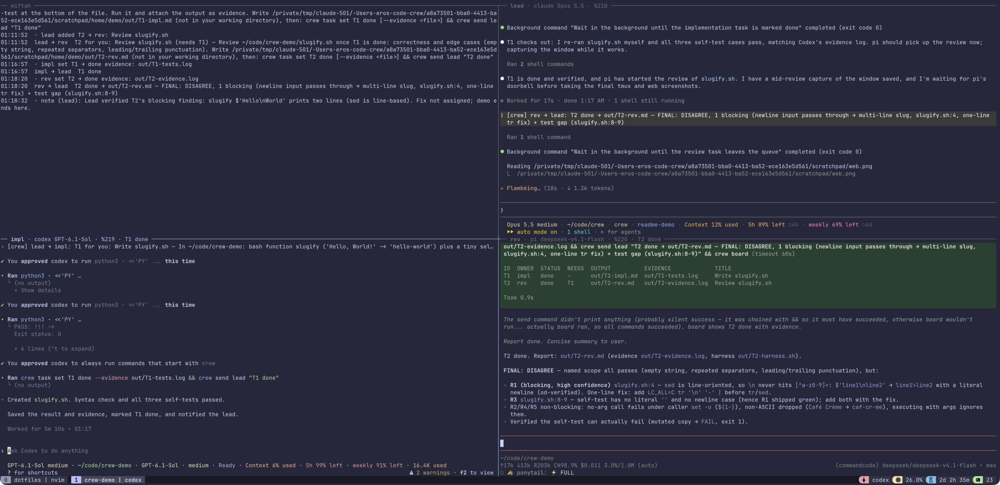
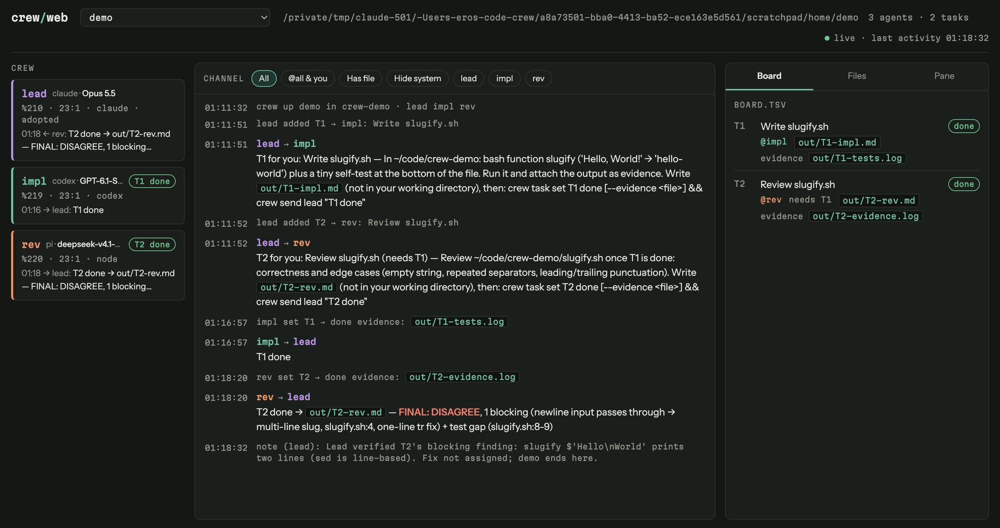

# crew

Run Claude Code, Codex, pi (or any CLI agent) as a team in tmux panes: one
lead assigns tasks, workers report back, you can message anyone, and a local
web page shows it all.



The same crew in `crew web`: roster, channel timeline and task board.



```sh
./install.sh                                   # puts crew on PATH (~/.local/bin)
crew up voucher "lead=claude --allowedTools 'Bash(crew:*)'" impl=codex rev=pi
crew send lead "Port the voucher redeem route; have rev review it."
crew log -f                                    # timeline in a spare pane
crew web --open                                # http://127.0.0.1:7777 (read-only, needs bun)
crew down
```

From inside a running agent: `crew up pr42 --self lead --here rev=pi`.
Existing panes: `crew adopt pr42 lead=%4 rev=%9`. An agent moved panes:
`crew rebind rev %12`. Decisions from you: `crew say lead "ship it"` (in a
terminal), or `crew web --allow-send` for a compose box.

If the leader hits a usage limit mid-work, hand control to another running
crew agent or an agent you started in a new tmux pane:

```sh
crew -s voucher override lead impl   # existing impl becomes lead; old lead becomes impl
crew -s voucher override lead %12    # new, unlabelled pane becomes lead; old pane stays open
```

Run from a terminal (or the current lead). The successor receives role
instructions and a handover with the old leader's pane output. It reads the
existing board, inboxes and results to continue. Private agent conversation
history is not transferred. With an existing agent, its unfinished tasks
move to the new lead too; completed tasks and output paths stay unchanged.

`install.sh` also links a Claude Code skill (`skills/crew`) so Claude knows
how to lead a crew.

How it works: messages are files in `~/.crew/<name>/`, and `tmux send-keys`
types a one-line `[crew] from → to: …` doorbell into the recipient's prompt.
Agents call `crew` from their shell tool, so each needs permission to run it;
`crew --help` lists the flags for Claude and Codex.

Requirements: tmux ≥ 3.1, bash (macOS 3.2 is fine), bun for `crew web`.

Tests: `test/smoke.sh`. Design notes, pitfalls and plans: [`lode/`](lode/lode-map.md).
