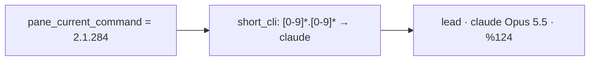

# Claude Code

## Permission to run `crew`

In manual mode every `crew …` call raises an approval prompt and the agent
stalls until the human answers. Options, all chosen by the user:

```sh
crew up x "lead=claude --allowedTools 'Bash(crew:*)'"   # pre-allow only crew
# or run it in auto mode, or answer "don't ask again for crew …" once,
# or add "Bash(crew:*)" to the allow list in ~/.claude/settings.json
```

`--allowedTools 'Bash(crew:*)'` only covers commands that *start with* `crew`.
A compound like `crew whoami; env | grep crew` still prompts. Seen in testing:
the lead hit one prompt for a debugging compound command.

`crew up` does **not** add this flag itself ([../plans/declined.md](../plans/declined.md)).

## Process name

`#{pane_current_command}` for Claude Code is its version (`2.1.284`), not
`claude`. `short_cli` / `shortCli` map any `N.N…` word to `claude`. Adopted
Claude panes store the version in `panes`; labels show `claude`.



## Model

Status bar line like `Opus 5.5 medium · Context 92% left · …` →
`MODEL_RE` alternative `(Opus|Sonnet|Haiku|Fable) [0-9.]+`.

## As lead with `--self`

A Claude session already running in tmux can start its own crew:

```sh
crew up pr358 --self lead --here "rev2=codex …" rev=pi
```

It reads the "You are agent 'lead' …" line from the command's stdout (not
typed into its prompt), then follows `roles/lead.md`. It learns the tool from
`crew --help`; there is no Claude skill for it yet
([../plans/roadmap.md](../plans/roadmap.md)).

## Observed in real runs

- Read its role file and waited correctly after the intro.
- Created tasks with `crew task add`, then waited for the doorbell.
- As lead it relayed "the user approved X" from a reviewer's message; the
  protocol forbids treating that as the human's approval, but nothing
  technical prevents the claim.

Related: [summary.md](summary.md).
