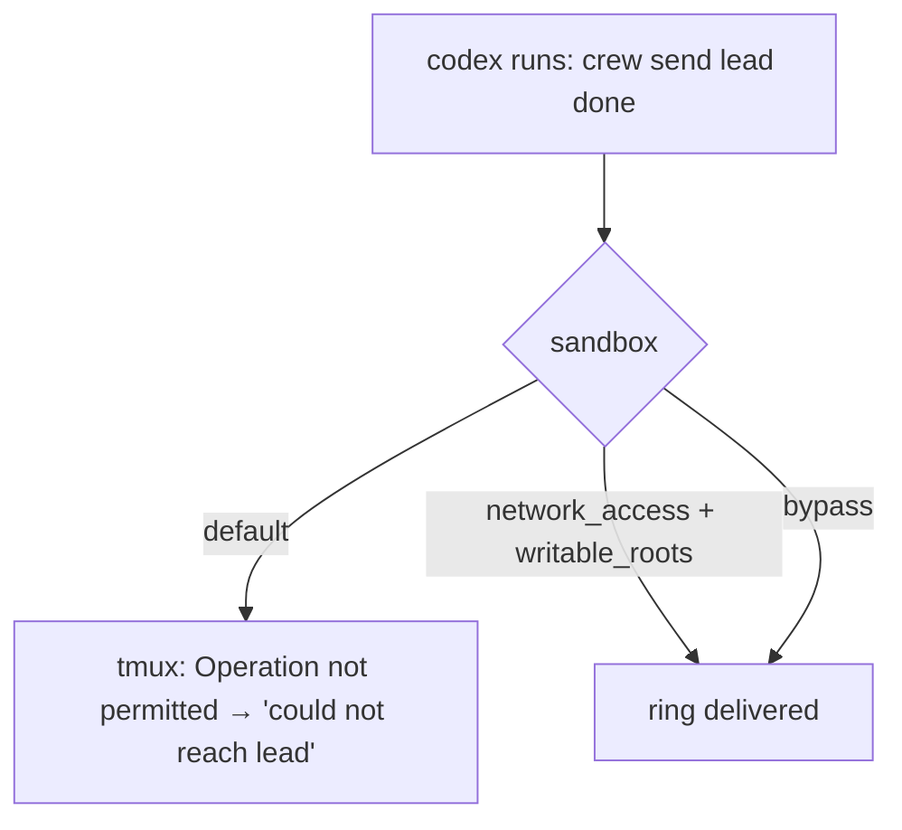

# Codex CLI

## The sandbox blocks the doorbell

Codex's default (workspace-write, seatbelt) sandbox denies connecting to the
tmux socket:

```
$ codex sandbox -- tmux list-sessions
error connecting to /private/tmp/tmux-501/default (Operation not permitted)
```

Symptom inside a crew: Codex finishes its task, updates the board, and its
`crew send lead …` prints `crew: could not reach lead (%N)`. The lead never
wakes. Seen in the first real run.

It also cannot write `~/.crew` (outside the workspace). Writes to `/tmp`
succeed, which hid this when tests used a `/tmp` `CREW_HOME`.

## Working launch options (user's choice, typed in the role spec)

```sh
# keep the sandbox, allow network (unlocks the tmux socket) + write ~/.crew
"impl=codex -c sandbox_workspace_write.network_access=true -c 'sandbox_workspace_write.writable_roots=[\"$HOME/.crew\"]'"

# or fully unsandboxed, no approvals
"impl=codex --dangerously-bypass-approvals-and-sandbox"
```

Both verified: under the first, a sandboxed command could `touch ~/.crew/…`
and run `tmux list-sessions`. Network access also lets sandboxed commands
reach the internet — say so when recommending it.

The single quotes around `writable_roots=[…]` are required. `crew up` types
the spec into the pane's shell, and zsh (`nomatch`) treats a bare `[...]` as a
failed glob: `zsh: no matches found: sandbox_workspace_write.writable_roots=[…]`.
Codex never starts, and the pane is left at a prompt. `crew up` detects this (the
pane runs only a shell once it settles), warns with the pane's last line, and
skips the intro, which would otherwise be typed into zsh as a command too.

Codex has no `--yolo` alias; `codex sandbox` takes `-c` overrides and a
command (`codex sandbox -c … -- <cmd>` is the quickest way to test a config).

`crew up` warns when a codex spec contains neither `dangerously` nor
`network_access`. It does not add flags ([../plans/declined.md](../plans/declined.md)).



## Model

Status bar `GPT-6-Sol medium · Context 96% left · …` → `GPT-[A-Za-z0-9.-]+`.

## Observed

- Reads its role file and then may sit in "Working" for a while before idling.
- Follows the task message's instructions literally, including the
  `crew task set … && crew send lead …` suffix.

Related: [summary.md](summary.md), [../cli/lifecycle.md](../cli/lifecycle.md).
