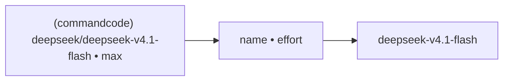

# pi

pi has no approval prompts or sandbox in the user's setup (`pi --help` only
offers `--approve/--no-approve` for trusting project-local files), so
`crew send` from pi works with no flags:

```sh
crew up pr358 --self lead rev=pi
```

## Model

The user's pi runs DeepSeek through a provider; the footer reads
`(commandcode) deepseek/deepseek-v4.1-flash • max`. `MODEL_RE`'s
`[A-Za-z0-9._-]+ • (off|minimal|low|medium|high|xhigh|max)` captures
`deepseek-v4.1-flash` (the `/` stops the match, dropping the provider).



## Observed

- After the intro it deliberated about "do not reply" and then printed a
  one-line standby note. Harmless.
- When a task message and the lead's `--msg` named different output paths,
  pi wrote both files ([../cli/tasks.md](../cli/tasks.md)).
- History from earlier manual sessions: pi was right on a big review item but
  wrong on arithmetic/counting claims it later retracted. Leads must verify
  reviewer claims against code.

## Unknowns

- Whether pi queues text typed into its prompt during a turn.
- Whether pi's shell tool has a tty (if it did, a non-member pi would be
  labelled `you (terminal)` instead of `outside`).

`pane_current_command` shows `node`; `detect_cli` finds `pi` in the tty's
process list, so adopted/rebound pi panes are labelled `pi`.

Related: [summary.md](summary.md).
