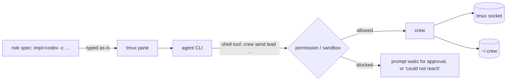

# Agent CLIs

`crew` is agent-agnostic: a role spec is typed verbatim into a pane. What each
CLI needs so its `crew send` works, and its quirks, is per-CLI knowledge:

| CLI | Needs for `crew send` | Label quirk | File |
|---|---|---|---|
| claude | permission to run `crew` (allowlist or auto mode) | process named after its version (`2.1.284`); `detect_cli` fixes it | [claude.md](claude.md) |
| codex | sandbox must reach the tmux socket **and** write `~/.crew` | none | [codex.md](codex.md) |
| pi | nothing (no approval system) | process is `node`; `detect_cli` fixes it | [pi.md](pi.md) |

## Shared behaviour to expect

- **The intro is a prompt.** Each CLI takes a turn on it: reads its role file,
  may print a one-line "standing by". Harmless; it stays in its own pane.
- **"Do not reply until you receive a task"** confuses some models (pi spent a
  turn deliberating how to reply without replying).
- **Input during a turn:** Claude and Codex queue a message typed while they
  work. Untested for pi.
- **Model name** is scraped from the status bar
  ([../cli/summary.md](../cli/summary.md)): claude `Opus 5.5`, codex
  `GPT-6-Sol`, pi `deepseek-v4.1-flash`.
- **Startup dialogs** (folder trust, codex update): `intro()` detects them and
  holds the intro until the human answers
  ([../cli/lifecycle.md](../cli/lifecycle.md#readiness-heuristic)). A new CLI's
  dialog footer may need adding to `DIALOG_RE`.

## Skill

`skills/crew/SKILL.md` teaches any agent to lead a crew: when to use it, its
own shell setup (claude: allow `Bash(crew:*)`; codex: its sandbox must reach
tmux and `~/.crew`, else it asks to be restarted; pi: nothing), asking the
user how Codex workers should run (never choosing the unsandboxed option
itself), and the lead's command set. Workers don't need it: the intro and
`roles/<role>.md` carry the protocol.

`install.sh` symlinks it into each agent's user skills dir, if that agent's
home exists: `~/.claude/skills/crew`, `~/.codex/skills/crew`,
`~/.pi/agent/skills/crew` (pi also reads `~/.agents/skills`; not used, to
avoid a duplicate). Keep it in sync with `--help` when commands change.

## Adding a new CLI

1. Confirm its shell tool can run `crew` and reach `$TMUX` (try `crew whoami`
   and `tmux list-sessions` from inside it).
2. Check its status bar contains something `MODEL_RE` matches; extend the
   regex in **both** `bin/crew` and `share/crew/web.ts`.
3. Check `detect_cli` names it (first non-shell process on the pane's tty); if
   its launcher is a wrapper, extend the shell skip-list or `short_cli`/`shortCli`.
4. Check whether its shell tool has a tty; if it does, a non-member instance
   would be labelled `you (terminal)` — note that in its file.
5. Add a file here with its flags and quirks, and a row to the table above.

Related: [../plans/declined.md](../plans/declined.md) (why crew doesn't add unsafe flags for you).
