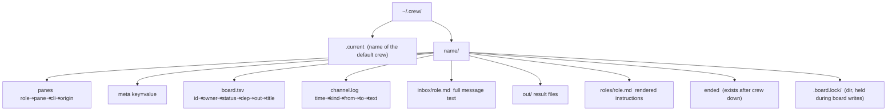

# State files (`~/.crew/<name>/`)

All plain text; tabs separate TSV fields; newlines/tabs inside message text are
flattened to spaces by `oneline()` before logging.



## `panes`

```
lead	%124	2.1.284	adopted
rev	%132	pi	spawned
rev2	%133	codex -c sandbox_workspace_write.network_access=true …	spawned
```

- `cli` is the role spec as typed (spawned) or `#{pane_current_command}`
  (adopted — Claude shows up as its version number, e.g. `2.1.284`).
- `origin` is `spawned` or `adopted`. Files written before this column existed
  have 3 fields; readers default a missing origin to `spawned`.

## `meta`

```
mode=up            # or adopt
window=@47         # window crew up created or split into
here=0             # 1 when --here split the caller's window
tmux_session=fsfe
created=2026-09-29T17:00:01
cwd=/private/tmp/tryout-pr358
```

## `board.tsv`

```
T1	rev	done	-	out/T1-rev.md	Round 1: independent review of PR #358
T2	rev2	queued	T1	-	Cross-check
```

Ids are `T<line count + 1>`, allocated under `.board.lock` (mkdir lock, 5 s
timeout, released by an EXIT trap even on `die`). `dep` and `out` use `-` for none.

## `channel.log`

```
2026-09-29T17:20:14	sys	lead	rev	lead added T1 → rev: Round 1 …
2026-09-29T17:20:14	dm	lead	rev	T1 for you: … Write /Users/…/out/T1-rev.md …
2026-09-29T17:24:02	all	you	all	pause
```

`kind` is `sys` (events), `dm` (to one role or `you`) or `all` (broadcast).
`from`/`to` are `-` for pure system lines.

## Lifecycle

- `crew up`/`adopt` refuse a name whose dir exists without `ended`. An ended
  dir is moved aside to `<name>.<timestamp>` and a fresh one created.
- `crew down` writes `ended`, clears `.current` if it pointed here, and keeps
  every file for later reading (`crew -s name log`, the web viewer).
- `pane_session` (lookup by pane id) skips ended crews.

Related: [summary.md](summary.md), [../cli/tasks.md](../cli/tasks.md).
