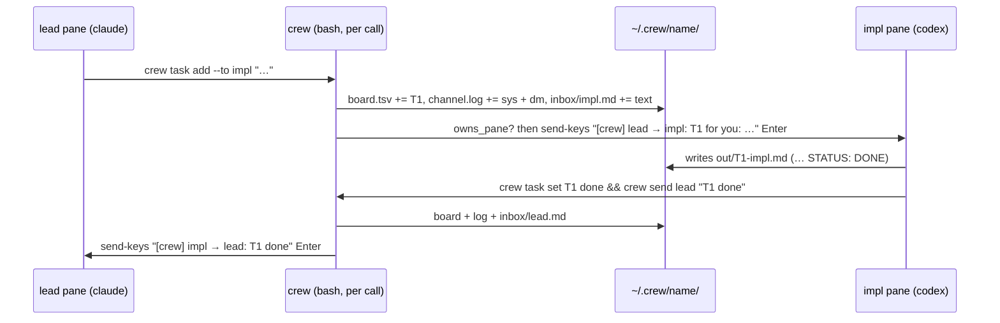

# Architecture

Three parts, no long-running core:

| Part | File | Runs when |
|---|---|---|
| CLI | `bin/crew` (bash) | each call, by the human or by an agent's shell tool |
| Templates | `share/crew/protocol.md`, `share/crew/roles/*.md` | rendered once per role at `crew up` / `crew adopt` |
| Web viewer | `share/crew/web.ts` + `web.html` (Bun) | only while `crew web` runs |

`bin/crew` finds `share/crew` next to its **real** path (`readlink -f "$0"`),
so a symlink on PATH still reads templates from the repo checkout.
`CREW_SHARE` overrides it; `CREW_HOME` (default `~/.crew`) holds crew state.

## Why files + tmux (and not IPC or MCP)

The agents are interactive TUIs. The only input all of them accept is text at
their prompt, so something must type into the pane to wake an idle agent.
Sockets or pipes would still need that step. An MCP server would give typed
tools but cannot push to an idle agent either, and pi may not speak MCP.
Hence: the message body goes in files, and one line of `send-keys` rings the
doorbell. Details in [../cli/messaging.md](../cli/messaging.md).



## Identity without a registry

Nothing is registered with a server. `crew` works out *which crew* and *who is
calling* on every call ([../cli/lifecycle.md](../cli/lifecycle.md)):

```sh
# crew:    -s flag → $CREW_SESSION → pane lookup ($TMUX_PANE in */panes) → ~/.crew/.current
# caller:  $CREW_AGENT (set by crew up via tmux -e) → $TMUX_PANE lookup → "you"
```

Spawned panes get `CREW_SESSION`, `CREW_AGENT`, `CREW_HOME` in their
environment. Adopted panes (already running) can't, so they are found by pane id.

## State files

See [state-files.md](state-files.md) for the exact formats.

## Invariants

- Every message is logged in `channel.log` and saved to the recipient's inbox
  **before** the doorbell rings; a failed ring loses nothing.
- Each file has one writer pattern: append-only (`channel.log`, `inbox/*`),
  or rewrite under a lock (`board.tsv`), or written once (`panes`, `meta`, `roles/*`).
- `crew` never types into or closes a pane that fails `owns_pane`.
- The web viewer never writes anything.

Related: [../cli/summary.md](../cli/summary.md), [../web/summary.md](../web/summary.md).
