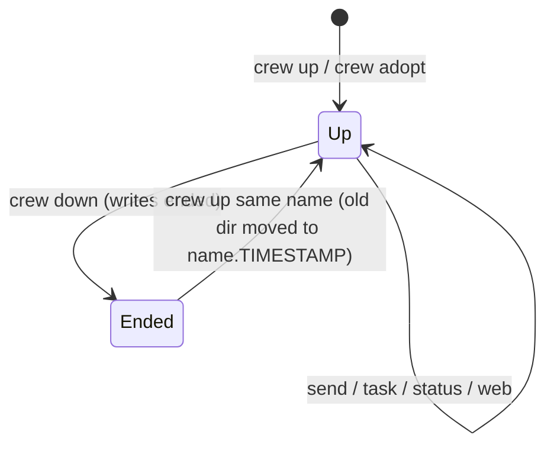

# Crew lifecycle: up, adopt, down



## `crew up <name> [options] role=cli …`

1. Parse `--in <tmux-session>`, `--self <role>`, `--here`; anything else
   starting with `-` is an error; `x=y` args are role specs.
2. Target session: `--in`, else the caller's (`display -p -t "$TMUX_PANE" '#S'`).
   `--self`/`--here` require `$TMUX_PANE`.
3. `check_roles` on every spec (and `--self`): valid name, non-empty value,
   no duplicates. It runs before anything exists, so a bad spec can't leave
   orphan panes or a crew dir that blocks the name.
   Then `init_dir`: refuse if the crew is up; move an ended one aside; create dirs.
4. `--self R`: label the caller's pane as `R`, record it as `adopted`.
5. For each spec: first pane via `new-window -d -n <name>` (or, with `--here`,
   `split-window` into the caller's window), the rest via `split-window` +
   `select-layout tiled`. Each gets `-e CREW_SESSION -e CREW_AGENT -e CREW_HOME`
   and `-c "$PWD"`. Record as `spawned`.
6. Write `meta`, `.current`, render role files, log a `sys` line.
7. Type each spec into its pane (the CLI starts), warn if a codex spec is
   sandboxed without network access ([../agents/codex.md](../agents/codex.md)).
8. In parallel per pane: `wait_ready` (screen `cksum` unchanged twice, ≥3 s,
   max `CREW_BOOT_WAIT`). If `detect_cli` finds only a shell, the command
   failed (see Readiness): warn with the pane's last line and send no intro.
   Otherwise `intro` (which refuses dialogs, see Readiness), then `refresh_model`.
9. `select-window` to the new window unless `--self`, `--here` or `CREW_NO_SWITCH`.
10. With `--self`, print the intro line on stdout: the calling agent reads it
    from its own command output instead of having it typed into its prompt.

```sh
crew up voucher lead=claude impl=codex rev=pi          # new window "voucher"
crew up pr358 --self lead --here "rev2=codex -c …" rev=pi   # agent starts its own crew
```

`--here` re-tiles the caller's window, resizing the user's existing panes.

## `crew adopt <name> role=<pane> …`

Pane refs are anything tmux resolves: `%7`, `.2`, `6.1`. `check_roles` and
resolving every ref (`pane_id`; the same pane twice is refused) happen before
`init_dir`, so a bad ref labels nothing. `pane_id` treats empty output as
not found: tmux 3.5 `display-message -p -t %999999` prints nothing and exits 0.
Then it labels each pane,
styles its window, records it as `adopted` with the detected program as cli
(`detect_cli`, [summary.md](summary.md)),
renders role files, rings the intro into every pane. Nothing is started or
moved. Adopted agents can't get `CREW_*` env vars, so identity comes from the
pane-id lookup.

## `crew down`

For each pane in `panes`:
- skip (with a warning) if `owns_pane` fails — the id is gone or reused;
- `spawned` → `kill-pane` (the caller's own pane last, so the script isn't
  killed mid-loop);
- `adopted` → unset `@crew_*` options and the window border options.

Then `ended` is written and `.current` cleared. Files stay.

## Pane ids

Roles are bound to tmux pane ids (`%124`). Ids are stable for a pane's life
(swap, resize, re-layout, `join-pane`, `break-pane`, `respawn-pane` all keep
them), so users can rearrange freely and add their own panes (e.g. nvim).
Ids restart after a tmux **server** restart, so an old crew's `%144` can
become an unrelated session — hence `owns_pane` ([messaging.md](messaging.md)).
If an agent's pane is closed and the agent restarted elsewhere, fix it with
`crew rebind`.

## `crew rebind <role> [pane] [--intro]`

```sh
crew rebind lead            # run inside the lead's new pane
crew rebind rev %201        # from anywhere
```

- Target defaults to the caller's `$TMUX_PANE`. Refuses if the target is
  already a role in this crew, or carries another crew's labels.
- Unlabels the old pane only if it still `owns_pane` (a reused id belongs to
  someone else — don't touch it).
- Rewrites the `panes` row under `.panes.lock`: new id, detected cli,
  `origin=adopted` (so `down` never closes a pane crew didn't create).
- Labels + styles the new pane, logs `sys: <caller> rebound <role> %old → %new`.
- Sends no intro unless `--intro` (the agent usually already knows its role);
  when run from the new pane it prints a reminder line on stdout.

## Readiness heuristic

`wait_ready` is a guess: spinners or clocks in a TUI can keep the screen
changing until the timeout. Claude and Codex queue input typed during a turn;
pi was not checked.

A startup dialog also "settles", and Enter picks its highlighted choice
(seen 2026-09-30, tmux 3.5a):

| CLI | dialog | highlighted choice |
|-----|--------|--------------------|
| claude | folder trust, footer `Enter to confirm · Esc to cancel` | `❯ No, exit` |
| codex | update, footer `enter continue · esc skip` | `› 1. Update now` (`brew upgrade`) |
| codex | folder trust, `Trust this folder?`, `enter continue · esc back` | `› 1. Trust and continue` |

A command that fails also "settles". The spec is typed into the user's shell,
so a shell error such as zsh's `no matches found` for an unquoted `[...]` in a
codex `-c` value (seen 2026-09-30) leaves the pane at a prompt. The intro would
then run as a shell command too. So `up` checks `detect_cli` after
`wait_ready`: no non-shell process means the agent isn't running. This check is
only in `up`, because `adopt` may take a pane the human runs a shell in.

Mid-session approval prompts are the same hazard for every doorbell (see
[messaging.md](messaging.md)); their text, from the CLI binaries (claude
2.1.285, codex 0.159.0): claude "Do you want to proceed?", codex "Would you
like to run the following command?" / "make the following edits" / "grant
these permissions" / "send input…", both "Yes, and don't ask again …".

`in_dialog` greps the last 15 non-blank lines for (case-blind)
`enter (to )?(confirm|continue)|trust this folder|do you want to proceed|would you like to (run|make|grant|send)|don.t ask again`.
`intro()` itself checks, so `up`, `adopt` and `rebind --intro` are all
covered: on a match it types nothing and prints the `crew send` line that
delivers the intro once the human has answered. crew never answers a dialog itself:
that would be trusting a folder or updating on the user's behalf. A per-CLI
"ready prompt" regex was rejected: claude's dialog uses the same `❯` as its
prompt. `--self` never types an intro (it prints one on stdout).

Related: [summary.md](summary.md), [../architecture/state-files.md](../architecture/state-files.md).
