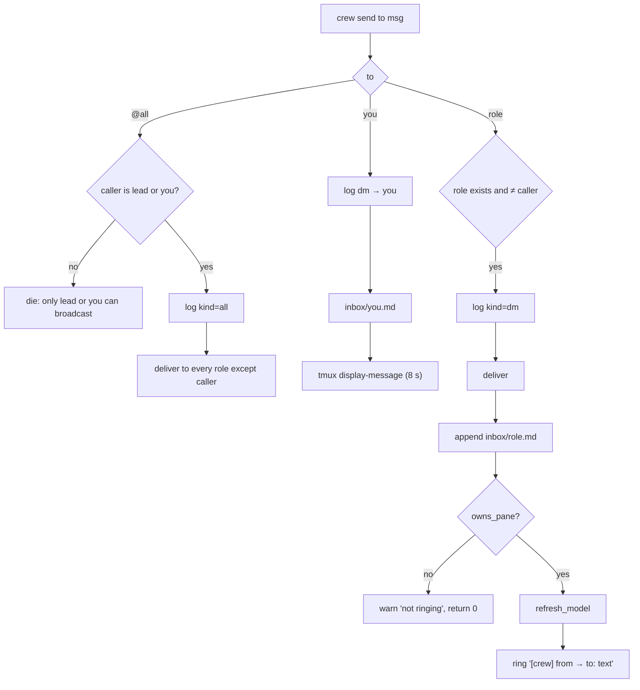
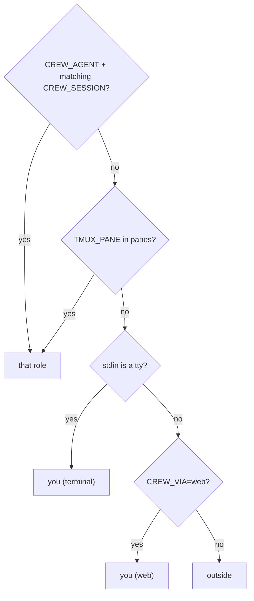

# Messaging: send, doorbell, ownership

## `crew send <to> <message…>`



- The body goes to `inbox/<role>.md` in full (markdown heading per message).
- The doorbell is the message flattened to one line. Over `RING_MAX` (500)
  chars it becomes `long message; read the latest entry in …/inbox/<role>.md`.
- `ring` = `send-keys -l -- "$text"`, sleep 0.3, `send-keys Enter`.
- `crew send you` has no pane: log + `inbox/you.md` + an 8-second tmux status
  message. Easy to miss; keep `crew log -f` or `crew web` open.
- The doorbell and inbox heading show `sender_label`: the role, `you (terminal)`,
  `you (web)`, or `outside %N (not in this crew)`.
- `crew say` = `send` that dies unless the caller resolves to `you`. It is the
  documented way for the human to give decisions.
- `crew note <text>` logs `sys: note (<caller>): text` (manual repairs, decisions).

## Ownership guard (`owns_pane`)

```sh
owns_pane() { # pane role
  local got
  got=$(tmux display-message -p -t "$1" '#{@crew_session}	#{@crew_role}' 2>/dev/null) || return 1
  [ "$got" = "$S	$2" ] || [ "$got" = "	$2" ]   # second form: crews labelled before @crew_session existed
}
```

Used by `deliver`, `set_pane_status`, `status` (shows `STALE (pane reused)`),
and `down` (skips the pane). Found in real use: after a tmux server restart an
old crew's lead id `%144` belonged to an unrelated Claude session, and
`status` looked healthy because both processes were named `2.1.284`.
Rings typed there would have become prompts in the wrong session.

The web viewer applies the same rule and shows the role as `stale`.

## Identity



Agents' shell tools run without a tty (checked for Claude Code), so an agent
that isn't a crew member shows up as `outside`, not as the human. `outside`
cannot broadcast or `say`. This is **advisory provenance**: it stops honest
mistakes (a reused pane, an agent relaying "the user approved X"), not a
hostile process, which could fake a tty (`script`), set `CREW_VIA`, or write
the files directly. Consequences for the human: `! crew send …` typed into a
Claude Code prompt runs without a tty and is labelled `outside`; use a
terminal pane or `crew web --allow-send`.

`crew whoami` in a pane that isn't in the crew adds a stderr hint:
`pane %157 isn't in crew X; if an agent moved here: crew rebind <role>`.

## `crew log`

`fmt_log` prints `HH:MM:SS  from → to  text` (`· text` for sys lines).
`-f` follows (`tail -f`), `-n N` sets the backlog (default 40).

Related: [summary.md](summary.md), [tasks.md](tasks.md), [../roles/summary.md](../roles/summary.md).
