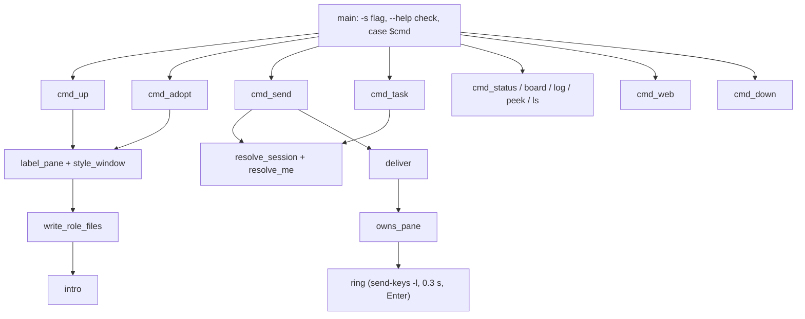

# CLI (`bin/crew`)

Single bash script, one `cmd_*` function per command, dispatched at the bottom.
`-s <name>` before the command selects a crew; `-h`/`--help` anywhere right
after a command prints the full usage (exit 0); unknown commands exit 1.

| Command | What it does | Detail |
|---|---|---|
| `up <name> [--self R] [--here] [--in S] role=cli …` | create panes, start CLIs, send intros | [lifecycle.md](lifecycle.md) |
| `adopt <name> role=<pane> …` | label existing panes, send intros | [lifecycle.md](lifecycle.md) |
| `send <role\|@all\|you> <msg>` | log + inbox + doorbell | [messaging.md](messaging.md) |
| `task add --to R [--dep T] [--msg M] <title>` | new board row + notify owner | [tasks.md](tasks.md) |
| `task set <id> <status> [--out F]` | update row, pane label, log | [tasks.md](tasks.md) |
| `board` / `status` | board table / agents + model + board | [tasks.md](tasks.md) |
| `log [-f] [-n N]` | formatted `channel.log` | [messaging.md](messaging.md) |
| `peek <role> [N]` | last N lines of the pane (`capture-pane -J`) | — |
| `web [--port N] [--open]` | exec the Bun viewer | [../web/summary.md](../web/summary.md) |
| `down` | close spawned panes, unlabel adopted ones, mark ended | [lifecycle.md](lifecycle.md) |
| `ls`, `whoami`, `path` | list crews, caller identity, crew dir | — |



## Environment knobs

| Variable | Default | Use |
|---|---|---|
| `CREW_HOME` | `~/.crew` | crew state root (tests point it at a temp dir) |
| `CREW_SHARE` | `<script dir>/../share/crew` | templates + web files |
| `CREW_BOOT_WAIT` | `30` | max seconds to wait for a new CLI to settle |
| `CREW_NO_SWITCH` | unset | don't `select-window` after `up` (tests) |
| `CREW_WEB_PORT` | `7777` | viewer port |
| `CREW_SESSION`, `CREW_AGENT` | set in spawned panes | identity |

## Pane labels and border

`label_pane` sets pane options; `style_window` turns on the top border:

```sh
tmux set-option -w -t "$win" pane-border-status top
tmux set-option -w -t "$win" pane-border-format \
  ' #{?@crew_role,#[bold]#{@crew_role}#[nobold] · #{@crew_cli}#{?@crew_model, #{@crew_model},} · #{pane_id}#{?@crew_status, · #{@crew_status},},#{pane_title}} '
# → " impl · codex GPT-6-Sol · %7 · T1 working "
```

Pane *titles* are not used: Claude and Codex overwrite them via terminal
escape codes. Pane user options survive that, and move with the pane through
swaps, re-layouts and `join-pane`. The border format is a **window** option,
so a crew pane moved to another window shows its label only after that window
gets `pane-border-status top`. Windows styled before a format change keep the
old format until restyled.

## Model detection

`detect_model` greps the last 6 non-blank screen lines for
`MODEL_RE` (`Opus|Sonnet|Haiku|Fable <ver>`, `GPT-…`, `<name> • <effort>`).
It is refreshed on intro, adopt, every delivery and every `status`. Screen
scraping breaks if a CLI changes its status bar; failure just omits the model.

Lessons:
- `tmux display-message -p '#S'` without `-t` reports the *attached client's*
  session, not the caller's; always pass `-t "$TMUX_PANE"`.
- `send-keys` text and `Enter` must be separate calls with a short pause, or
  some TUIs treat the newline as part of a paste.

Related: [../architecture/summary.md](../architecture/summary.md), [../agents/summary.md](../agents/summary.md).
