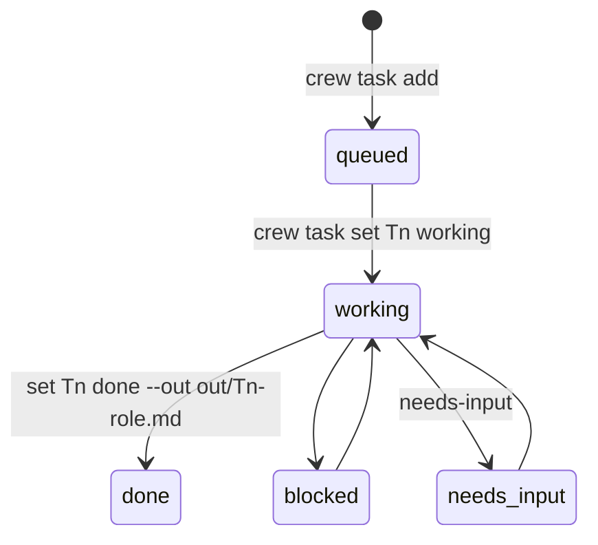

# Tasks and the board



## `crew task add --to <role> [--dep T1] [--msg "…"] <title…>`

Under the board lock: id = `T<rows+1>`, append
`id⇥owner⇥queued⇥dep|-⇥-⇥title`. Then: log a `sys` line, set the owner's
`@crew_status` to `Tn queued`, and `crew send` the owner (so there is no need
for the lead to also message them):

```
T3 for you: <title> (needs T2) — <msg>. Write /Users/…/.crew/<name>/out/T3-rev.md
(not in your working directory), then: crew task set T3 done --out out/T3-rev.md
&& crew send lead "T3 done"
```

The result path is **absolute** on purpose: agents run in the repo, and a
relative `out/` would create files inside the worktree (breaking reviewers'
read-only rule). Prints the new id on stdout.

Known rough edge: a `--msg` that names its own output path produces two
conflicting paths, and agents write both. `task add --out` is on the roadmap.

## `crew task set <id> <status> [--out <file>]`

Status must be `queued|working|done|blocked|needs-input`. Under the lock,
rewrites the row via `awk` → `board.tsv.tmp` → `mv`. Then updates the owner's
pane label (only if `owns_pane`) and logs `"<caller> set Tn → status (file)"`.

## Locking

```sh
lock_board()   { mkdir "$D/.board.lock" (retry 50 × 0.1 s, then die); trap 'rmdir …' EXIT; }
unlock_board() { rmdir "$D/.board.lock"; trap - EXIT; }
```

Without it, two concurrent `task set`s lost an update and two `task add`s
could get the same id. `test/smoke.sh` runs 15 parallel adds and 15 parallel
sets. A crash between `mkdir` and the trap could leave a stale lock; the die
message names the directory to remove.

## `crew board` / `crew status`

`board` prints the TSV with headers via `column -t`. `status` prints
`ROLE CLI MODEL PANE RUNNING LAST-MESSAGE` for every role (RUNNING is the
short cli, `(gone)`, or `STALE (pane reused)`), then the board.

## Result file contract (from protocol.md)

- Path `~/.crew/<name>/out/<task>-<role>.md`.
- Last line exactly `STATUS: DONE|BLOCKED|NEEDS-INPUT`; reviewers
  `FINAL: AGREE|DISAGREE`. Tools (the web viewer, the lead) key on these.
- No evidence field yet: a brief can claim "verified E2E" with nothing on
  disk backing it. `--evidence` is on the roadmap.

Related: [messaging.md](messaging.md), [../architecture/state-files.md](../architecture/state-files.md).
