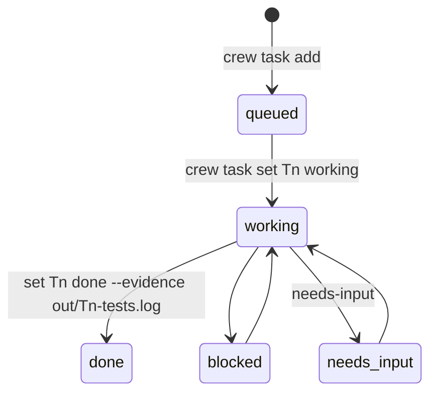

# Tasks and the board



## `crew task add --to <role> [--dep T1] [--out out/x.md] [--msg "…"] <title…>`

`--out` (bare `x.md` becomes `out/x.md`; anything else must match
`^out/[A-Za-z0-9._-]+\.md$`) names the task's one result file; the default is
`out/<id>-<owner>.md`. Under the board lock: id = `T<rows+1>`, append
`id⇥owner⇥queued⇥dep|-⇥out⇥title⇥-`. Then: log a `sys` line, set the owner's
`@crew_status` to `Tn queued`, and `crew send` the owner (so there is no need
for the lead to also message them):

```
T3 for you: <title> (needs T2) — <msg>. Write /Users/…/.crew/<name>/out/T3-rev.md
(not in your working directory), then: crew task set T3 done [--evidence <file>]
&& crew send lead "T3 done"
```

The result path is **absolute** on purpose: agents run in the repo, and a
relative `out/` would create files inside the worktree (breaking reviewers'
read-only rule). Prints the new id on stdout.

A `--msg` that *also* names a path would still conflict; `lead.md` tells the
lead to name paths only with `--out` (pi once wrote both files when it wasn't).

## `crew task set <id> <status> [--out <file>] [--evidence <file>]`

Status must be `queued|working|done|blocked|needs-input`. Only the task's
owner, `lead` or `you` may set it (advisory, like sender labels: it stops a
worker closing someone else's task by mistake). Under the lock,
rewrites the row via `awk` → `board.tsv.tmp` → `mv`; `--evidence` fills
column 7 (old 6-column rows gain it). Then updates the owner's
pane label (only if `owns_pane`) and logs `"<caller> set Tn → status (file)"`.

## Locking

```sh
lock board   # mkdir "$D/.board.lock" (retry 50 × 0.1 s, then die); trap 'rmdir …' EXIT
unlock board # also used as: lock panes / unlock panes (crew rebind)
```

Without it, two concurrent `task set`s lost an update and two `task add`s
could get the same id. `test/smoke.sh` runs 15 parallel adds and 15 parallel
sets. A crash between `mkdir` and the trap could leave a stale lock; the die
message names the directory to remove.

## `crew board` / `crew status`

`board` prints `ID OWNER STATUS NEEDS OUTPUT EVIDENCE TITLE` via `column -t`
(title last so long titles don't push columns). `status` prints
`ROLE CLI MODEL PANE RUNNING LAST-MESSAGE` for every role (RUNNING is the
short cli, `(gone)`, or `STALE (pane reused)`), then the board.

## Result file contract (from protocol.md)

- Path `~/.crew/<name>/out/<task>-<role>.md`.
- Last line exactly `STATUS: DONE|BLOCKED|NEEDS-INPUT`; reviewers
  `FINAL: AGREE|DISAGREE`. Tools (the web viewer, the lead) key on these.
- Claims that something was run or verified need an evidence file (command +
  output, e.g. `out/T3-tests.log`) attached with `--evidence`. The lead treats
  claims without one as unverified; the web board shows `no evidence` on done
  tasks that lack it. Found in use: a brief said "verified E2E, 150 tests"
  while the PR said "not checked in a browser, 147".

Related: [messaging.md](messaging.md), [../architecture/state-files.md](../architecture/state-files.md).
