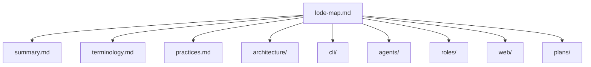

# Lode map

- [summary.md](summary.md) — one-paragraph snapshot of what crew is
- [terminology.md](terminology.md) — domain terms (role spec, doorbell, owns_pane, stale pane, …)
- [practices.md](practices.md) — bash 3.2 rules, gates, safe testing, safety rules, lode upkeep
- architecture/
  - [summary.md](architecture/summary.md) — parts, why files + tmux, identity, invariants
  - [state-files.md](architecture/state-files.md) — exact formats of `~/.crew/<name>/*`
- cli/
  - [summary.md](cli/summary.md) — command table, env knobs, pane labels/border, model detection
  - [lifecycle.md](cli/lifecycle.md) — `up` / `adopt` / `rebind` / `down`, `--self` / `--here`, pane ids, readiness
  - [messaging.md](cli/messaging.md) — `send`/`say`/`note`, doorbell, `owns_pane`, sender identity, `log`
  - [tasks.md](cli/tasks.md) — board, `task add --out` / `set --evidence`, locking, result-file contract
- agents/
  - [summary.md](agents/summary.md) — per-CLI needs table, shared behaviour, adding a CLI
  - [claude.md](agents/claude.md) — permission prompts, version-named process, `--self` lead
  - [codex.md](agents/codex.md) — sandbox blocks tmux + `~/.crew`, working flags
  - [pi.md](agents/pi.md) — no prompts, model footer, observed quirks
- roles/
  - [summary.md](roles/summary.md) — protocol.md, role templates, rendering, editing
- web/
  - [summary.md](web/summary.md) — `crew web` API, opt-in send, security, client, checks
- plans/
  - [roadmap.md](plans/roadmap.md) — open questions (pi/codex tty, readiness, ring floods) and candidates
  - [declined.md](plans/declined.md) — settled decisions (no `--yolo`, no group chat, opt-in web send, advisory provenance)
- skill: `../skills/crew/SKILL.md` — Claude Code skill (documented in [agents/claude.md](agents/claude.md))
- examples/
  - [crew-web-mockup.html](examples/crew-web-mockup.html) — interactive design mockup (sample data)
- tmp/ — git-ignored session scraps and handovers
