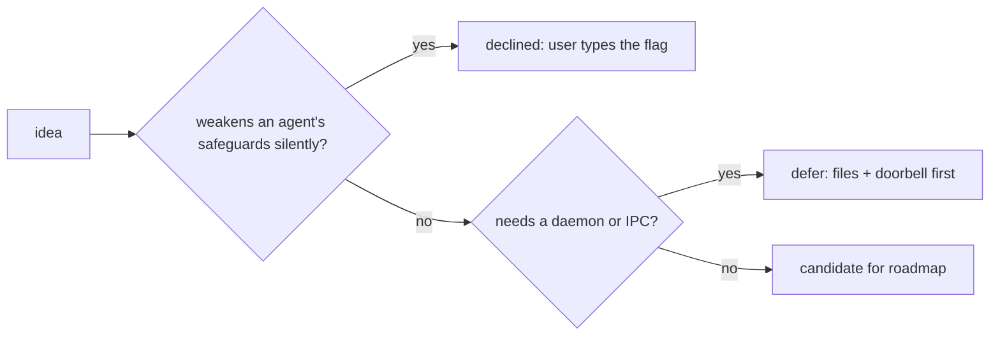

# Decisions and declined ideas

Settled choices, with the reason, so they aren't re-proposed without new facts.



## No `--yolo` shortcut, no auto-added permission flags

Proposed: `crew up --yolo[=roles]` mapping to `--dangerously-skip-permissions`
(claude) / `--dangerously-bypass-approvals-and-sandbox` (codex); and having
`crew up` auto-append codex sandbox overrides or claude's
`--allowedTools 'Bash(crew:*)'`. The Claude Code auto-mode safety classifier
blocked all of these while building ("Create Unsafe Agents"), and the user
accepted keeping flags explicit.

Current rule: the launch command is exactly the role spec the user typed.
`crew` only **documents** the flags (`--help`, [../agents/](../agents/summary.md))
and **warns** (sandboxed codex). An agent working on this repo must not
re-add a shortcut or an auto-flag; if the user wants one, they decide how to
allow it.

```sh
# the explicit form stays:
crew up x "lead=claude --allowedTools 'Bash(crew:*)'" "impl=codex --dangerously-bypass-approvals-and-sandbox"
```

## Files + tmux doorbell, not IPC/MCP (for now)

See [../architecture/summary.md](../architecture/summary.md). An MCP server may
come later as an optional front door that writes the **same** files.

## Not a full group chat

Agents receive only messages addressed to them (DMs and `@all`); the shared
`channel.log` is for the human and for on-demand `grep`. Reasons: every agent
reading everything bloats context, agents reply to every message (storms),
live exposure anchors reviewers, and streaming "thinking" into a channel adds
noise. Only lead and you may broadcast.

## One lead, not a mesh

Workers report to the lead; the lead decides "done". Peer-to-peer consensus
loops ("talk until you agree") burn tokens; the lead caps disagreements at 3
rounds and escalates to the human.

## tmux integration choices

- Default is a **new window** in the caller's session (matches the user's
  one-window-per-task habit); `--here` and `--self` cover joining an existing
  window; a separate tmux session is not implemented (low demand).
- Labels are pane user options in the border, not pane titles (agents
  overwrite titles).

## Web viewer is read-only (v1)

Watching/debugging was the goal; sending from a browser page to agents with
write access needs an explicit opt-in design ([roadmap.md](roadmap.md) item 8).
Not a claude.ai artifact: it can't read local files/tmux and would ship agent
output off-machine.

Related: [roadmap.md](roadmap.md), [../practices.md](../practices.md).
