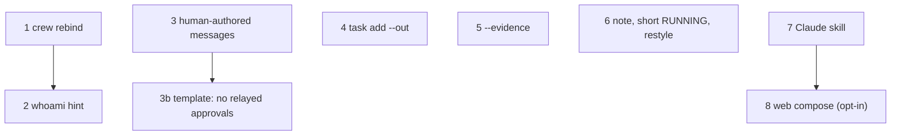

# Roadmap

Ordered by value. Items marked **(field)** came from a lead agent's report
after running crew on a real PR review (pr357); **(design)** from the design
discussion. When one ships, move its description into the matching lode file
and delete it here.

## 1. `crew rebind <role> [pane]` (field)

An orphaned role (pane closed, agent restarted elsewhere, or a STALE id)
currently needs hand-editing `panes`, moving `@crew_*` labels and appending a
log line. `adopt` can't help: it creates a new crew, fails "duplicate role",
and re-sends every intro. Wanted: default pane = caller's `$TMUX_PANE`;
refuse if the target pane `owns_pane`s another role or crew; rewrite the
`panes` row (keep `origin=adopted`), unset labels on the old pane only if it
still `owns_pane`s, label the new one, style its window, log
`sys: <caller> rebound <role> %old → %new`; send **no** intros (optionally
`--intro`). Add a smoke check.

## 2. `whoami` hint (field)

In a pane not in the crew, `whoami` prints `you in crew X` silently. Print a
stderr hint when `$TMUX_PANE` is set but unregistered:
`pane %157 isn't in crew X; run crew rebind <role>`.

## 3. Human-authored messages (field)

A worker can write "User approved the fix…" and the lead can't tell it from
the human. Add `crew say <to> <msg>` (or `send --as you`) that refuses to run
when the caller resolves to a crew role, logs `from=you`, and rings with a
distinct prefix. 3b: tell agents in `protocol.md` to ask the human to send
decisions (`crew say`) instead of relaying them.

## 4. `crew task add --out <path>` (field)

Replace the template's `Write …/out/Tn-role.md` path, so `--msg` and the
template can't name two outputs (pi wrote both). Store it in the `out` column
at add time.

## 5. Evidence for claims (field)

`crew task set Tn done --evidence <file>` (stored in a new board column or
logged), and a line in `lead.md` asking briefs to cite evidence for anything
"already verified". Mind the TSV column change in `web.ts`.

## 6. Small items (field)

- `crew note "<text>"` → a `sys` log line (for manual repairs, decisions).
- `status` RUNNING already shows the short cli; adopted pi panes still show
  `node` — map via the role spec when known.
- `crew restyle` to apply the current border format to a crew's windows (old
  crews keep the format they were started with).

## 7. Claude skill for crew (design)

A `~/.claude/skills/crew/SKILL.md` so a normal Claude session knows when and
how to `crew up --self lead …` without being told to read `--help`.

## 8. Web viewer write path (design, opt-in)

Compose box that calls `crew send` as `you`. Must stay opt-in
(`crew web --allow-send`) since it turns the page into a way to prompt agents
that can write code; keep the Host check and add a per-run token.

## Open questions

- pi: does it queue input during a turn? Does its sandboxing change with config?
- `wait_ready` false positives (trust dialogs) and false negatives (animated
  status bars); a per-CLI ready pattern may be better than screen stability.
- Doorbells typed mid-turn into Codex/Claude arrive as queued prompts — fine so
  far, but a flood of rings could stack up. Consider coalescing.
- SSE instead of 2 s polling for the viewer, if it ever matters.

Related: [declined.md](declined.md), [../summary.md](../summary.md).
