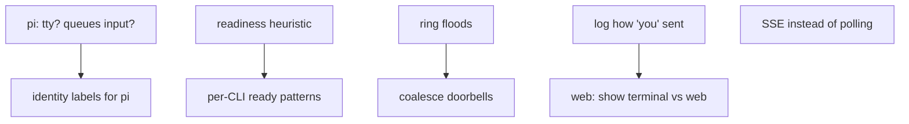

# Roadmap

Nothing from the first field report (pr357 lead) or the design discussion is
pending: rebind, whoami hint, `crew say` + sender labels, `task add --out`,
`--evidence`, `note`, `restyle`, agent-name detection, the Claude skill and
opt-in web sending are all in place (see [../lode-map.md](../lode-map.md)).
What remains are open questions and candidate improvements. When one ships,
describe it in the matching lode file and delete it here.

## Open questions

- **pi**: does its shell tool have a tty (would a non-member pi be labelled
  `you (terminal)`)? Does it queue text typed during a turn?
- **Codex**: does its shell tool have a tty? Checked only for Claude Code.
  Test: from inside the agent run `crew -s <crew> whoami` in a crew it isn't
  part of; expect `outside`.
- **Readiness**: `wait_ready` (screen stable) misfires on trust dialogs and
  animated status bars. A per-CLI "ready" regex (e.g. codex `› Ask Codex`,
  claude `❯`) may be more reliable; keep stability as the fallback.
- **Doorbell floods**: many rings to a busy agent become many queued prompts.
  Consider coalescing ("3 new messages, read inbox/x.md") when a pane got a
  ring within the last N seconds.

## Candidate improvements

1. **Record the channel in the log.** `channel.log` says `from=you` for both
   terminal and web; the doorbell shows the difference, the log doesn't. A
   6th column (`via`) would let the web viewer show it; keep readers tolerant
   of 5-field lines.
2. **`crew rebind` for adopt-style bulk moves** after a tmux server restart:
   `crew rebind --all` matching roles to panes by detected cli + cwd, with a
   confirmation list.
3. **SSE for the viewer** instead of 2 s polling, only if polling cost shows up.
4. **Evidence checks**: warn in `task set … done` when a result file contains
   words like "tests pass" / "verified" but no `--evidence` was given.

Related: [declined.md](declined.md), [../summary.md](../summary.md).
