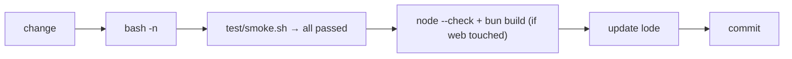

# Practices

## Shell compatibility

`bin/crew` must run on macOS's stock **bash 3.2** and BSD userland:

- no associative arrays, `${var,,}`, `mapfile`, `readarray`, `|&`;
- no `grep -P` (BSD grep lacks it) — use `grep -E` or `awk`;
- `sed -i ''` for in-place edits; `readlink -f` exists on macOS ≥ 12.3 (bin/crew falls back to `$0`);
- empty arrays under `set -u` break `"${arr[@]}"` in 3.2 — check `${#arr[@]}` first;
- `source <(…)` silently does nothing in 3.2 — write to a temp file and `.` it.

TSV files are read with `IFS="$(printf '\t')" read -r role pane cli origin`.
Always name the **last** field (`origin`), or it swallows the rest of the line.

## Gates (run before every commit)



```sh
bash -n bin/crew                  # syntax
test/smoke.sh                     # behaviour; must print "all passed"
node --check <(sed -n '/<script>/,/<\/script>/p' share/crew/web.html | sed '1d;$d')
bun build --no-bundle share/crew/web.ts >/dev/null
```

`test/smoke.sh` uses its own `CREW_HOME` (mktemp) and a detached tmux session,
so it never touches real crews. `KEEP=1 test/smoke.sh` keeps both for
debugging. Extend it whenever behaviour changes — it is the only test suite.

## Testing against real agents

- Never test in the user's own tmux session. Use `crew up … --in <detached-session>`
  plus `CREW_NO_SWITCH=1`, and a scratch `CREW_HOME`.
- `crew up` passes `CREW_HOME` into panes (`-e CREW_HOME=…`); a scratch home
  exported only in your own shell would otherwise be invisible to the agents.
- Use `cat` as a stand-in agent: every ring shows up twice (tty echo + cat).
- Your own shell tool has no tty, so `crew` calls you make outside a crew
  resolve to `outside`. To act as the human in tests, run through
  `script -q /dev/null crew …` (the `human` helper in `test/smoke.sh`).
- In zsh, `crew $c` with `c="up --help"` does **not** word-split; call with
  separate words when looping over commands.
- The user's live crews are in `~/.crew/`. Reading them (status, web, peek) is
  fine; do not send into or `down` a crew you did not start.

## Safety rules that shape the design

- Before typing into or closing a pane, call `owns_pane "$pane" "$role"`
  ([cli/messaging.md](cli/messaging.md)). Add the check to any new code path
  that sends keys or kills panes.
- `crew` must not silently weaken an agent's safeguards. The launch command is
  exactly the role spec the user wrote; see [plans/declined.md](plans/declined.md).
- `crew web` binds 127.0.0.1, checks the `Host` header, validates crew names
  and file paths by regex; its only write path (`/api/send`) requires
  `--allow-send`, a same-origin request and the per-run token.
- Sender labels are advisory ([plans/declined.md](plans/declined.md)); don't
  describe them as security in docs or messages.

## Git

The user's global gitignore (`~/.config/git/ignore`) excludes `skills/`; this
repo's `.gitignore` re-includes it with `!skills/`. After adding files there,
check `git ls-files skills` before pushing.

## Style

- One function per command (`cmd_up`, `cmd_send`, …); helpers above them.
- Comments explain *why* (tmux quirks, CLI quirks), not what.
- User-facing errors via `die "…"` (prefix `crew:`); warnings to stderr.
- Keep role templates short and imperative; agents read them once at intro.

## Lode upkeep

Lode files describe the current state. When behaviour changes, update the
matching file under [cli/](cli/summary.md), [agents/](agents/summary.md),
[web/](web/summary.md) or [roles/](roles/summary.md), then
[plans/roadmap.md](plans/roadmap.md). Session scraps go in `lode/tmp/`.
