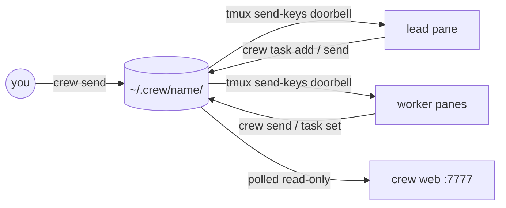

# crew — Living Snapshot

`crew` runs several coding-agent CLIs (Claude Code, Codex, pi) as a team inside
tmux. It is one bash script (`bin/crew`, macOS bash 3.2 compatible) plus
markdown role templates (`share/crew/`) and a Bun web viewer (read-only by default)
(`share/crew/web.ts` + `web.html`). Messages are plain files under
`~/.crew/<name>/`; tmux `send-keys` is only the "doorbell" that types a
one-line `[crew] from → to: …` notice into the recipient's prompt. There is no
daemon and no IPC: each `crew` call does its work and exits, and agents call it
from their own shell tool. A crew has one **lead** that assigns tasks on a
board (`board.tsv`), workers that write results to `out/` ending in an exact
`STATUS:` / `FINAL:` line and back claims with evidence files, and the human
(`you`), who messages from a terminal (`crew say`) or the web viewer.
Doorbells name the sender (`impl`, `you (terminal)`, `you (web)`, `outside`)
so relayed "approvals" and stray agents are visible; the labels are advisory.
Before typing into or closing a pane, `crew` checks the pane still carries
this crew's labels, because tmux pane ids are reused after a server restart;
`crew rebind` moves a role to a new pane. `crew override lead impl` promotes
an existing agent mid-work; `crew override lead %12` adopts a new successor
pane. Overrides preserve history and results and save recovery context. The web viewer (`crew web`,
127.0.0.1:7777) polls a small JSON API and shows roster (detected agent and
model names), timeline, board, files and pane captures; it is read-only unless
started with `--allow-send`. A Claude Code skill (`skills/crew`) teaches any
Claude session to lead a crew. Verification is `test/smoke.sh`, which runs a
throwaway crew of `cat` agents in a detached tmux session.

Start with [lode-map.md](lode-map.md); open work is in
[plans/roadmap.md](plans/roadmap.md).
