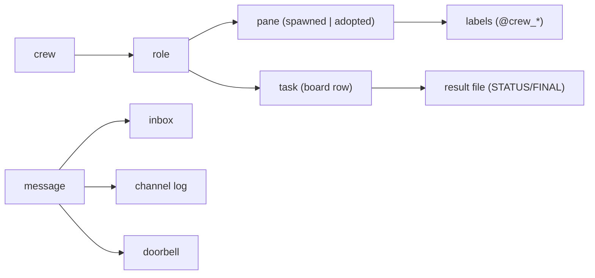

# Terminology

- crew - one named team of agents; state lives in `~/.crew/<name>/`.
- agent - one CLI process (claude, codex, pi, …) running in its own tmux pane.
- role - an agent's name inside a crew (`lead`, `impl`, `rev`, `rev2`, `test`); also picks its template (`rev2` → `roles/rev.md`).
- lead - the coordinating role; creates tasks, verifies claims, may broadcast. Special-cased by name.
- you - the human; any `crew` call from a pane not registered in the crew is attributed to `you`.
- role spec - `role=cli` argument to `crew up`; everything after `=` is typed verbatim into the new pane (flags included).
- spawned pane - a pane `crew up` created; `crew down` closes it.
- adopted pane - a pane that already existed (`crew adopt`, `crew up --self`); `crew down` only removes its labels.
- doorbell / ring - typing one line + Enter into a pane with `tmux send-keys` so the agent sees a new message.
- intro - the first ring an agent gets: "You are agent '<role>' … read roles/<role>.md".
- protocol - `share/crew/protocol.md`, prepended to every role file; the messaging and result rules.
- role file - `~/.crew/<name>/roles/<role>.md`, rendered at `crew up` from protocol + role template.
- board - `board.tsv`, the task list (`T1`, `T2`, …) with owner, status, dependency, output file.
- task status - one of `queued | working | done | blocked | needs-input`.
- result file - `~/.crew/<name>/out/<task>-<role>.md`, ends with `STATUS: …` or (reviewers) `FINAL: AGREE|DISAGREE`.
- channel log - `channel.log`, the append-only timeline of every message and system event.
- inbox - `inbox/<role>.md`, full text of every message delivered to that role.
- broadcast - `crew send @all`; only `lead` and `you` may send one.
- labels - tmux pane user options `@crew_session`, `@crew_role`, `@crew_cli`, `@crew_model`, `@crew_status`, rendered in the pane border.
- owns_pane - the ownership check: a pane is ours only if its labels still say this crew and role.
- stale pane - a recorded pane id that now belongs to something else (id reuse); never rung, never closed.
- current crew - `~/.crew/.current`, the crew used when nothing else identifies one.
- settle - the pane screen stopped changing (two identical `cksum`s after ≥3 s); `crew up` sends the intro then.
- short cli - the program name used in labels (`codex --sandbox …` → `codex`; `2.1.284` → `claude`).
- model detection - scraping the model name from the bottom lines of a pane's status bar.
- round 1 / round 2 - review protocol: independent findings first, cross-check of accepted/rejected items second.
