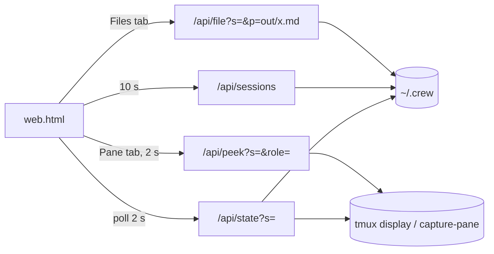

# Web viewer (`crew web`)

`crew web [--port N] [--open]` execs `bun share/crew/web.ts`, which serves
`web.html` and a JSON API on `127.0.0.1:${CREW_WEB_PORT:-7777}`. Read-only:
no endpoint writes files or sends keys. `-s name` opens that crew first.

## API

| Endpoint | Returns |
|---|---|
| `/api/sessions` | `[{name, ended, updated}]`, live first, newest first |
| `/api/state?s=` | `{name, dir, ended, panes[], board[], log[], files[]}`; each pane has `role, pane, cli, origin, alive, stale, cmd, status, where, model` |
| `/api/file?s=&p=` | `{path, text}` for `p` matching `^(out\|inbox\|roles)/[A-Za-z0-9._-]+\.md$` |
| `/api/peek?s=&role=` | last 80 lines of the pane (`capture-pane -J`), `text: null` if gone |

`stale` uses the same ownership rule as `owns_pane`
([../cli/messaging.md](../cli/messaging.md)); stale panes get no model scrape.

## Security

- Binds `127.0.0.1` only; rejects any `Host` other than `127.0.0.1`/`localhost`
  (blocks DNS-rebinding reads of agent output).
- Crew names and file paths are regex-validated (no `..`, no absolute paths).
- tmux is called with an argv array (`Bun.spawnSync`), never a shell string.

## Client (`web.html`)

Plain JS, no build. Layout: roster (role colour by index, short cli + model,
status pill from `@crew_status`, `stale`/`gone`), channel timeline with
filters (all, `@all & you`, has file, hide system, per role), and Board /
Files / Pane tabs. File references in messages (`…/out/x.md`) become links.
New messages animate and "ring" the recipient's card. The header shows
`live · last activity HH:MM:SS` (the last log entry, not the poll time) with a
green/red connection dot. Colours are theme tokens with a dark-mode block.

The interactive design mockup it was built from is
[../examples/crew-web-mockup.html](../examples/crew-web-mockup.html)
(sample data; includes a disabled compose box that v1 deliberately omits).

## Checks

`test/smoke.sh` covers state (3 agents), path traversal (`bad path`) and a
foreign `Host` (403). After editing `web.html`, syntax-check its script with
`node --check` (see [../practices.md](../practices.md)); the server reads
`web.html` once at startup, so restart `crew web` to see changes.

Related: [../architecture/summary.md](../architecture/summary.md).
