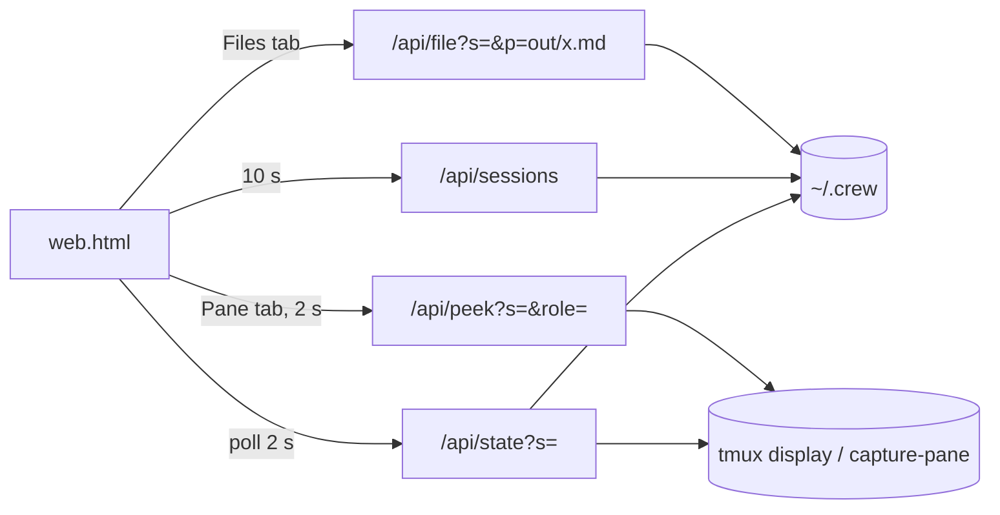
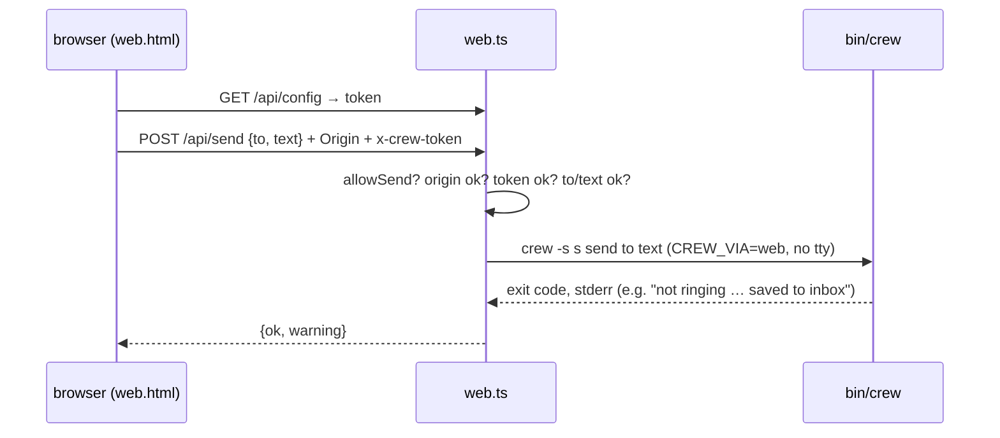

# Web viewer (`crew web`)

`crew web [--port N] [--open] [--allow-send]` execs `bun share/crew/web.ts`,
which serves `web.html` and a JSON API on `127.0.0.1:${CREW_WEB_PORT:-7777}`.
Read-only by default. `--allow-send` adds a compose box that runs
`crew send` as `you (web)`. `-s name` opens that crew first.

## API

| Endpoint | Returns |
|---|---|
| `/api/sessions` | `[{name, ended, updated}]`, live first, newest first |
| `/api/config` | `{allowSend, token}` (token only when sending is on) |
| `/api/state?s=` | `{name, dir, ended, panes[], board[], log[], files[]}`; each pane has `role, pane, cli, origin, alive, stale, cmd, status, where, model`; board rows have `evidence` |
| `/api/file?s=&p=` | `{path, text}` for `out\|inbox\|roles/*.md` or `out/*.log\|txt` |
| `POST /api/send?s=` | `{to, text}` → spawns `crew -s s send to text` with `CREW_VIA=web`; `{ok, error?, warning?}` |
| `/api/peek?s=&role=` | last 80 lines of the pane (`capture-pane -J`), `text: null` if gone or no longer carrying this crew's labels (reused id) |

`stale` uses the same ownership rule as `owns_pane`
([../cli/messaging.md](../cli/messaging.md)); stale panes get no model scrape.

## Security

- Binds `127.0.0.1` only; rejects any `Host` other than `127.0.0.1`/`localhost`
  (blocks DNS-rebinding reads of agent output).
- Crew names and file paths are regex-validated (no `..`, no absolute paths).
- tmux and crew are called with argv arrays (`Bun.spawnSync`), never a shell string.
- `/api/send` (only with `--allow-send`): POST only; `Origin` must be this
  server; header `x-crew-token` must equal a random per-run token served by
  `/api/config` (a custom header also forces a CORS preflight, which is never
  approved); recipient must be `@all` or a valid name; 1–4000 chars. The
  child gets `CREW_AGENT`, `CREW_SESSION`, `TMUX_PANE` blanked and stdin
  closed, so crew resolves the sender as `you (web)`.

## Client (`web.html`)

Plain JS, no build. Layout: roster (role colour by index, short cli + model,
status pill from `@crew_status`, `stale`/`gone`), channel timeline with
filters (all, `@all & you`, has file, hide system, per role), and Board /
Files / Pane tabs. File references in messages (`…/out/x.md`, `out/x.log`)
become links. Board rows show the evidence file, or `no evidence` on done
tasks without one. With sending on, a compose form (recipient select +
input) sits under the timeline and reports the server's error or warning.
New messages animate and "ring" the recipient's card. The header shows
`live · last activity HH:MM:SS` (the last log entry, not the poll time) with a
green/red connection dot. Colours are theme tokens with a dark-mode block.

The interactive design mockup it was built from is
[../examples/crew-web-mockup.html](../examples/crew-web-mockup.html)
(sample data).

## Checks

`test/smoke.sh` covers state (3 agents), path traversal (`bad path`), a
foreign `Host` (403), send off by default (403), missing token (403), foreign
Origin (403), and a delivered send rung as `you (web)`. After editing `web.html`, syntax-check its script with
`node --check` (see [../practices.md](../practices.md)); the server reads
`web.html` once at startup, so restart `crew web` to see changes.

Related: [../architecture/summary.md](../architecture/summary.md).
